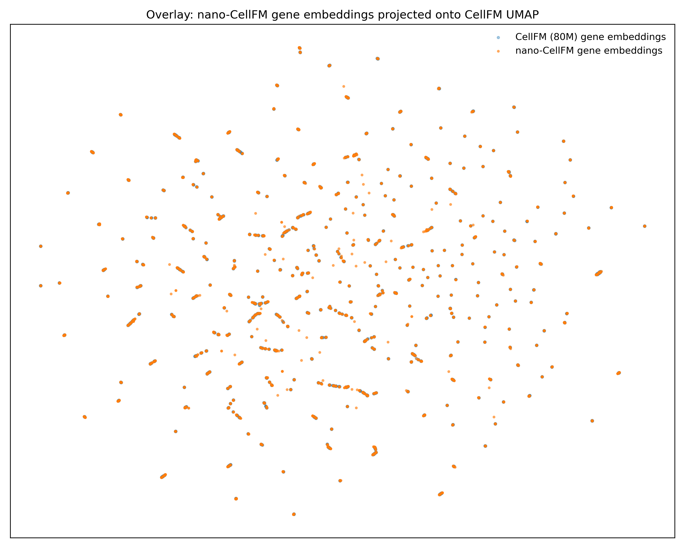

# nano-CellFM

A minimal, fast, and faithful reimplementation of [CellFM](https://github.com/biomed-AI/CellFM) for single-cell foundation model inference, with planned support for fine-tuning and training from scratch.

nano-CellFM is designed to make CellFM easier to understand, modify, and run while preserving the behavior of the original model.

<!--  -->

nano-CellFM aims to provide:
- A clean and minimal implementation
- Faithful reproduction of the original CellFM architecture
- Faster inference with modern PyTorch optimizations
- A codebase suitable for experimentation, fine-tuning, and future training from scratch

## The nano-scFMs Project
Single-cell foundation models (scFMs) are one of the most promising directions in AI for biology, yet many existing repositories remain difficult to read, extend, benchmark, or use as educational resources.

nano-CellFM is part of **nano-scFMs**, a collection of lightweight reimplementations of popular single-cell foundation models. The goal is to make state-of-the-art scFMs easier to understand, extend, benchmark, and use as educational resources.

All repositories are implemented in pure, modern PyTorch and follow a consistent coding style, making it straightforward to install, compare, and experiment with different models using the same environment and shared [requirements file](https://github.com/huynguyen250896/nano-CellFM/blob/main/requirements.txt). 

Available Models:

- [X] [nano-scBERT](https://github.com/huynguyen250896/nano-scBERT)
- [X] [nano-Geneformer](https://github.com/huynguyen250896/nano-Geneformer)
- [X] nano-CellFM
- [ ] nano-scFoundation
- [ ] nano-scPRINT
- [ ] nano-TranscriptFormer
- [ ] nano-Nicheformer

**NOTE:** Danqi Liao has already created an excellent minimal implementation of scGPT, so I chose not to duplicate that effort. If you're looking for a lightweight version of scGPT, check out [nano-scGPT](https://github.com/Danqi7/nano-scGPT).

If you know of another single-cell foundation model that should be included, feel free to open an issue or send me a message. To keep the collection focused on established methods, I currently only plan to include models that have been published in peer-reviewed journals.

## Benchmark 
I carefully benchmarked nano-CellFM across different settings to give future users confidence in adopting nano-CellFM as a drop-in alternative to the official implementation. Full benchmark details are available in [benchmark_CellFM_vs_nano.ipynb](benchmark_CellFM_vs_nano.ipynb).

#### Inference Runtime
A direct runtime comparison against the original CellFM is currently unavailable because the official implementation depends on MindSpore, and our compute environment does not provide compatible GPU support.

•) Gene embedding
| Model           | Total (15,681 cells) |      Per cell |        Throughput |      Peak GPU | % Reduced Peak GPU |   Speedup |
| --------------- | ------------------: | ------------: | ----------------: | ------------: | -----------------: | --------: |
| **nano-CellFM** |         **275.10 s** | **17.544 ms** | **57.00 cells/s** | N/A |           N/A | N/A |
| CellFM          |            -- s |     -- ms |     -- cells/s |     N/A |                  N/A |     1.00× |

•) Cell embedding
| Model           | Total (15,681 cells) |      Per cell |        Throughput |      Peak GPU | % Reduced Peak GPU |   Speedup |
| --------------- | ------------------: | ------------: | ----------------: | ------------: | -----------------: | --------: |
| **nano-CellFM** |         **19.17 s** | **1.223 ms** | **817.88 cells/s** | N/A |           N/A | N/A |
| CellFM          |            N/A |     N/A |     N/A |     N/A |                  N/A |     1.00× |

**Note.** The official CellFM implementation is based on MindSpore. Since our compute environment does not provide GPU support for MindSpore, we report only nano-CellFM runtime. Reproducing the official runtime benchmark is left as future work. If you have access to a GPU-enabled MindSpore environment, PRs with reproducible runtime benchmarks against the official implementation are very welcome.

#### Cell-level Embedding Reproducibility
The extremely high cosine similarity and negligible numerical differences indicate that nano-CellFM faithfully reproduces the original CellFM embeddings.

<!--  -->

| Metric                    |         Value |
| ------------------------- | ------------: |
| Mean cosine similarity    |    **1.0000** |
| Median cosine similarity  |    **1.0000** |
| Minimum cosine similarity | **1.0000** |
| Mean absolute difference  |  **9.78e-09** |
| Distance correlation      | N/A |

#### Gene-level Embedding Reproducibility
The near-perfect cosine similarity together with the extremely small absolute differences demonstrate that nano-CellFM numerically matches the original CellFM implementation.



| Metric                    |         Value |
| ------------------------- | ------------: |
| Mean cosine similarity    |    **1.0000** |
| Median cosine similarity  |    **1.0000** |
| Minimum cosine similarity | **0.999999** |
| Mean absolute difference  |  **6.24e-08** |
| Distance correlation      | N/A |

> Benchmarked on a single NVIDIA A100 (80 GB) GPU with batch size 32 on the Pancreas dataset (1,000 genes and 15,681 cells).

## Install
```bash
git clone https://github.com/huynguyen250896/nano-CellFM.git
cd nano-CellFM

pip install -r requirements.txt
```

## Quick Start
### Using nano-CellFM in Python
#### Generate Cell Embeddings from Raw-count `.h5ad`
```python
import torch
import scanpy as sc

from model import CellFM
from CellFM_tokenizer import CellFMTokenizer

device = torch.device("cuda" if torch.cuda.is_available() else "cpu")

model_name = "CellFM-80M"
model = CellFM.from_pretrained(model_name=model_name).to(device)
model.eval()

adata = sc.read_h5ad("data/pancreas.h5ad")

tokenizer = CellFMTokenizer.from_pretrained(model_name=model_name)

expr, gene, zero_idx = tokenizer.encode(adata)

embs = model.encode(
    expr,
    gene,
    zero_idx,
    batch_size=64,
    embedding_type="cell",
)

# (n_cells, 1536)
embs = embs.numpy()
```

#### Generate Gene Embeddings from Raw-count `.h5ad`
```python
import torch
import scanpy as sc

from model import CellFM
from CellFM_tokenizer import CellFMTokenizer

device = torch.device("cuda" if torch.cuda.is_available() else "cpu")

model_name = "CellFM-80M"
model = CellFM.from_pretrained(model_name=model_name).to(device)
model.eval()

adata = sc.read_h5ad("data/pancreas.h5ad")

tokenizer = CellFMTokenizer.from_pretrained(model_name=model_name)

expr, gene, zero_idx = tokenizer.encode(adata)

embs = model.encode(
    expr,
    gene,
    zero_idx,
    batch_size=64,
    embedding_type="gene",
)

# (n_cells, n_genes, 1536)
embs = embs.numpy()
```

### Using nano-CellFM from the Terminal
#### Generate Cell Embeddings from Raw-count `.h5ad`
```bash
python tasks/cell_embedding.py \
    --input data/pancreas.h5ad \
    --output outputs/nano_cellfm_cell_embeddings.npy \
    --model CellFM-80M \
    --batch-size 256
```

#### Generate Gene Embeddings from Raw-count `.h5ad`
```bash
python tasks/gene_embedding.py \
    --input data/pancreas.h5ad \
    --output outputs/nano_cellfm_gene_embeddings.npy \
    --model CellFM-80M \
    --batch-size 256
```

## Roadmap
- [X] Gene and Cell Embedding .h5ad scRNA data
- [ ] Finetuning for cell type classification
- [ ] Training from scratch

Let me know what tasks you'd like to see next!

## Acknowledgments
1. If you find this repo interesting and/or use nano-CellFM in your work, please cite the original paper:
>Zeng, Y., Xie, J., Shangguan, N. et al. CellFM: a large-scale foundation model pre-trained on transcriptomics of 100 million human cells. Nat Commun 16, 4679 (2025). https://doi.org/10.1038/s41467-025-59926-5

and STAR⭐ my repo. Thanks!

2. nano-CellFM is inspired by Andrej Karpathy's [nanoGPT](https://github.com/karpathy/nanogpt), Chris Hayduk's [minAlphaFold2](https://github.com/ChrisHayduk/minAlphaFold2), and especially Danqi Liao's [nano-scGPT](https://github.com/Danqi7/nano-scGPT).

## License
[MIT LICENSE](LICENSE)
